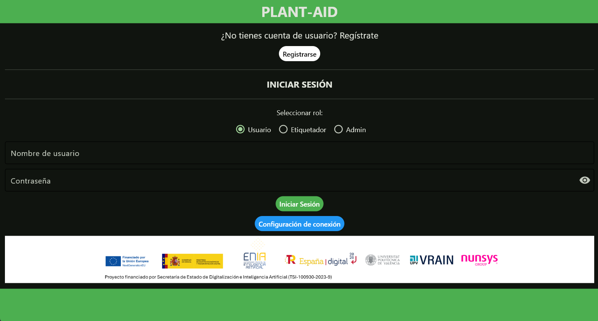
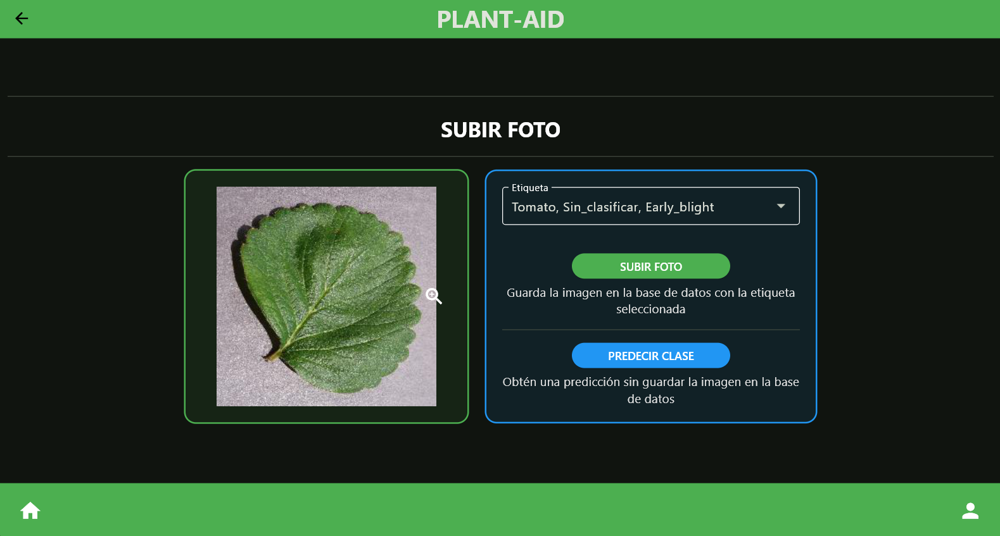
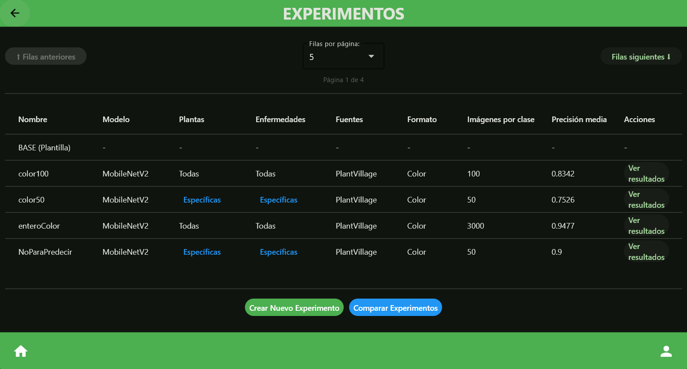
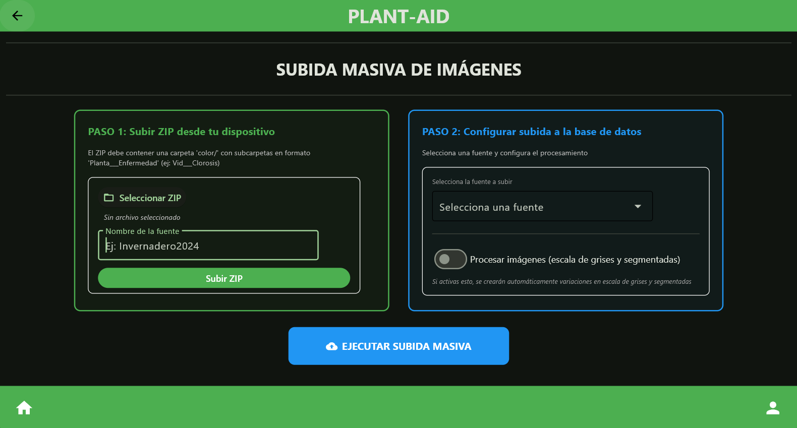
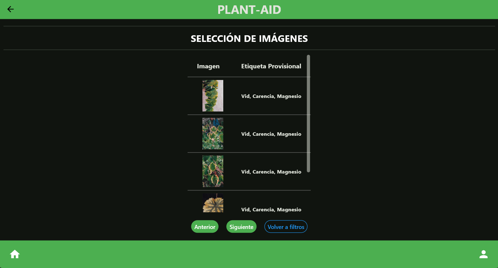
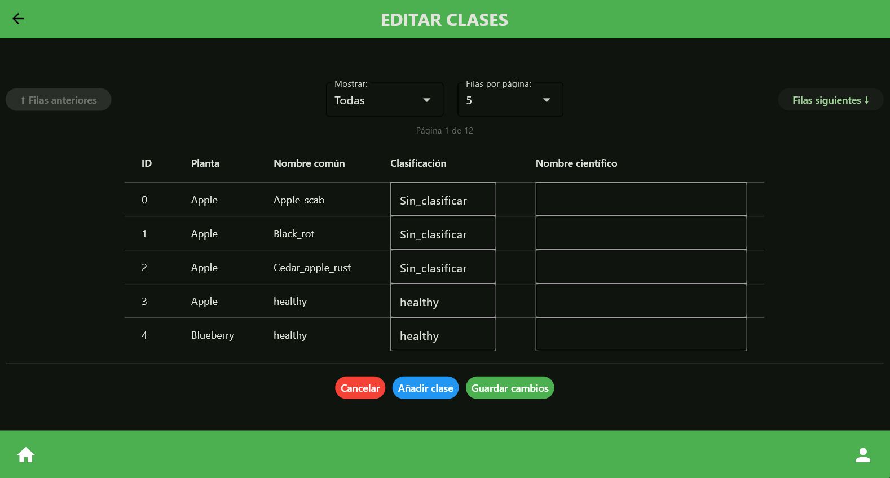
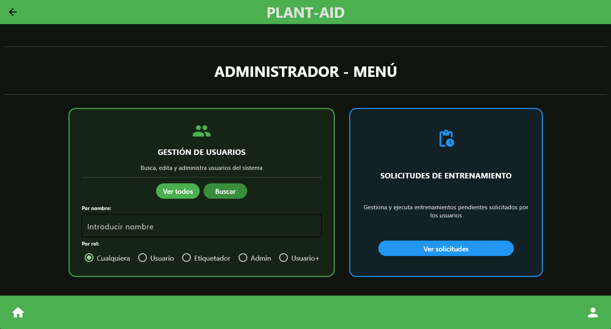

# Guía para Usuarios Finales

Este documento está pensado para personas sin conocimientos técnicos que quieren usar la aplicación de forma sencilla.

---

## 1. Descargar la aplicación

Descarga la versión de Windows, Android o Linux desde el enlace de distribución.

En el caso de Windows, el archivo final será un `.exe` que podrás abrir con doble clic.

---

## 2. Instalar la aplicación

Si te entregan un instalador, ejecútalo y sigue el asistente.

Si te entregan una carpeta portable, entra dentro y abre `Plant-AId.exe`.

La aplicación se conecta al servidor de la universidad, así que solo necesita que la URL de la API esté configurada correctamente.

**URL de la API:** {indicar aquí la URL final}

---

## 3. Primer uso

### 3.1. Iniciar la aplicación

- **Windows**: haz doble clic en el icono del escritorio.
- **Android**: abre `Aplicaciones` y busca `PlantAid`.

En Windows no hace falta abrir Python ni una terminal. La aplicación se abre como cualquier programa instalado.

### 3.2. Primera pantalla

Si no tienes una cuenta todavía, regístrate y se te dará el rol de Usuario. Si quieres otro rol, contacta con el desarrollador.

Una vez tengas tu cuenta, selecciona tu rol e inicia sesión con tus credenciales.

Si te da error de conexión, asegúrate de que la dirección a la que te estás conectando es la correcta en **Configuración de conexión**.

---

## 4. Funciones principales para usuarios

### 4.1. Subir imágenes

- Pulsa el botón **Subir Foto**.
- Selecciona una imagen de una hoja.
- Elige la etiqueta de tu imagen si la conoces.
- La imagen se añade a la base de datos.
- Si está disponible, un modelo puede predecir la etiqueta de tu imagen.

### 4.2. Ver experimentos

- Pulsa el botón **Experimentos**.
- Aquí se muestran los modelos ya entrenados y sus características.
- Puedes ver los resultados de cada modelo y compararlos.
- Puedes crear un nuevo experimento y solicitar su entrenamiento.

### 4.3. Subir imágenes masivamente

- Pulsa el botón **Subida masiva**.
- Sube un conjunto de imágenes.
- Esta funcionalidad es delicada.
- Se requiere rol de **Usuario+**.

---

## 5. Requisitos para Windows

- Permite que Windows ejecute la aplicación la primera vez si el antivirus o SmartScreen muestran un aviso.
- Si la app no conecta, revisa en **Configuración de conexión** que la URL de la API sea la correcta.

---

## 6. Funciones principales para etiquetadores

### 6.1. Etiquetar o validar imágenes

- Pulsa el botón **Etiquetar/Validar**.
- Filtra qué imágenes quieres comprobar.
- Selecciona una imagen de la lista.
- Selecciona la etiqueta.
- Haz clic en **Etiquetar**.
- Valida si estás seguro/a de que la etiqueta es correcta.

### 6.2. Editar clases

- Pulsa el botón **Editar clases**.
- Navega a través de las clases existentes.
- Modifica la clasificación de la enfermedad o su nombre científico.
- Guarda los cambios.
- Añade clases si es necesario.
- Procede con cuidado y después de consultar.

---

## 7. Funciones principales para administradores

- Gestión de usuarios: borrar usuario, conceder o eliminar roles
- Gestión de solicitudes de entrenamiento

---

## 8. Problemas comunes

---

## 9. Soporte

Si tienes problemas o preguntas, contacta con: [pralfes@etsinf.upv.es](mailto:pralfes@etsinf.upv.es)

